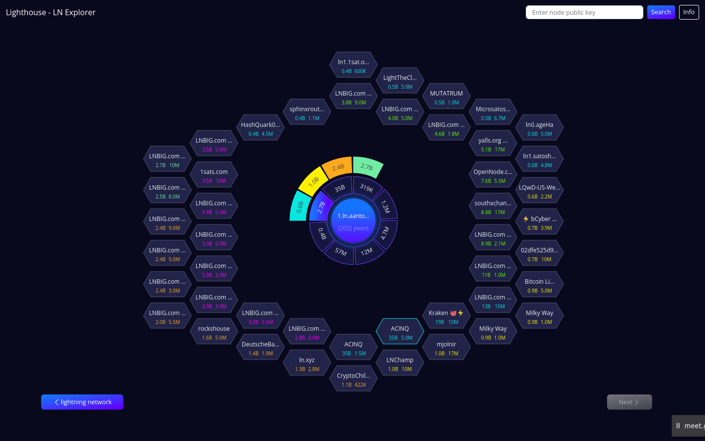
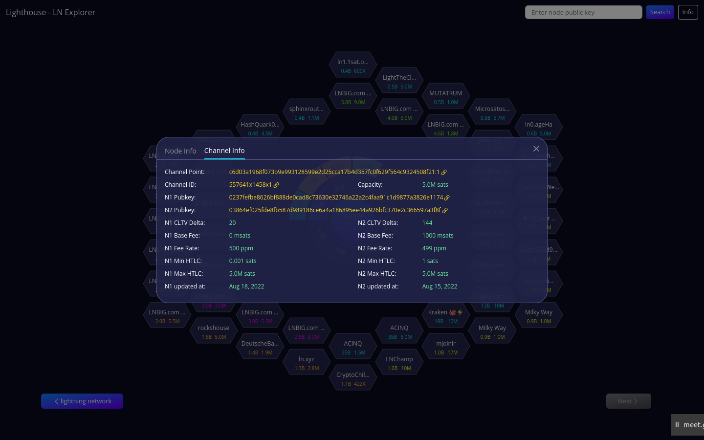
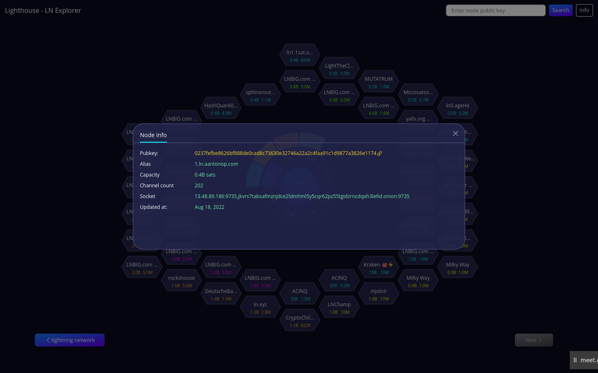

Yet another Lightning network explorer, build with ReactJS

# Screenshots

To learn LN, we created this explorer.

# How to use?
- Peers are clustered by their node capactiy.
- Click on Hexagonal peer to explore their peers
- Longpress on root / LN nodes (hex) for additional info.

# Source code
[https://github.com/saiy2k/lighthouse-web](https://github.com/saiy2k/lighthouse-web)
[https://github.com/saravanan7mani/lighthouse](https://github.com/saravanan7mani/lighthouse)

# Reach us at
[@saravananmani\_](https://twitter.com/saravananmani_), [@saiy2k](https://twitter.com/saiy2k)

# To hire me
- This app is my 'Proof of Work'
- Looking to quit my fiat job and take a bitcoin job.
- Contributed to [RTL Lightning node manager](https://github.com/Ride-The-Lightning/RTL/pulls?q=is%3Apr+author%3Asaiy2k)
- Participant of Chaincode lab's Bitcoin Protocol Developmnet course.
- To hire me, you can reach out to [saiy2k@gmail.com](mailto:saiy2k@gmail.com), [Linkedin](https://www.linkedin.com/in/saiy2k/), [Twitter](https://twitter.com/saiy2k)

Credits
Thunder sound fx: [Pixabay](https://pixabay.com/sound-effects/)

# Components
App
  * AboutBox
  * StormCanvas
  * GraphController
    * LNCanvas
      * ClusterLayer
        * ClusterSegment
      * PeerLayer
        * PeerHex3
    * FilterModal
    * InfoBox
    * MobileWarning
  * Constants
  * Interface
  * useLongPress
  * Utils

# Store
  * slide
    * currentIndex: number
    * sortParams: string[]
    * sortIndex: number
    * sortShow: boolean
    * items: array[]
        * index: number
        * pubkey: string
        * root: ILNNode
        * error?: string
        * status: string
        * peers: ILNNode[]
        * selectedBuckets: string[]
    * rawNodes
  * ui:
    * hoverNode
    * l2, l3, l4, l5
    * infoPeer

